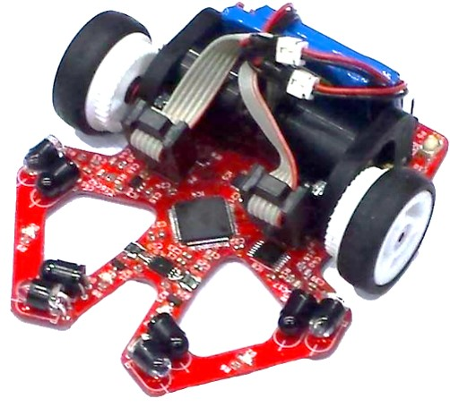
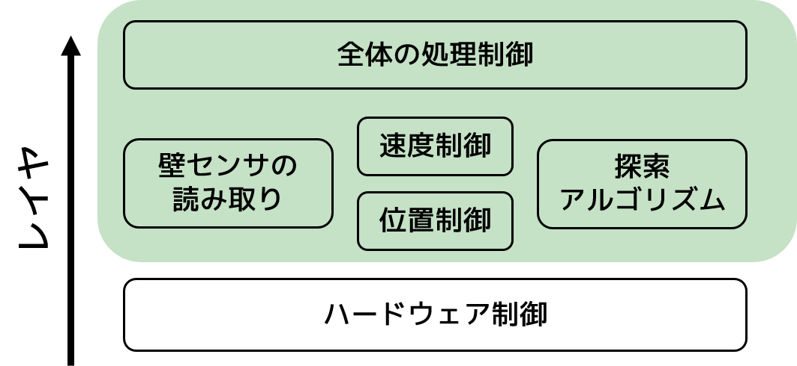
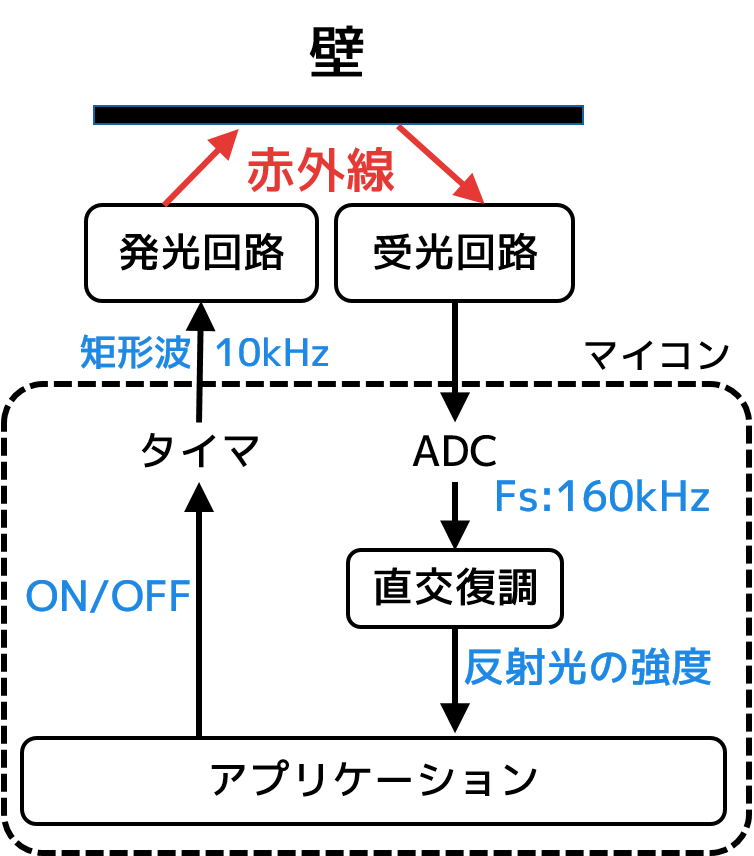

# MIZUHOについて
## 概要
マイクロマウスの機体です。  

第37回全日本マイクロマウス大会のクラッシック競技フレッシュマンクラスに出場しました。  
予選を通過し、決勝では11位のタイムで完走しました。

## 使用部品

|          |                 |
|------------------|--------------------------|
| マイコン         | STM32F405RGT                |
| 6軸センサ        | MPU6500                  |
| モータドライバ   | DRV8835                  |
| フォトダイオード | SFH213FA                 |
| 赤外線LED        | VSLY5850                 |
| モーター         | Faulhaber 1717+IEH2-1024 |
| バッテリー       | Hyperion 1cel 120mA × 2  |

# 内容物
* pcb/ : kicadの基板データ
* firmware/ : stm32のファームウェア(eclipseのプロジェクトファイル)

# ファームウェアについて 
## 構成
↓の画像のような構成になっています。

[FreeRTOS](http://www.freertos.org/)を利用しています。  
上の画像の緑の色のついている部分がFreeRTOSのタスクになっています。  

## 制御の概要
だいたいこんな感じです。

## 探索アルゴリズム
[以前作ったもの](https://github.com/idt12312/MazeSolver2015)を使用しています。

# 回路について
[回路図はここからpdfダウンロードできます。](./doc/micromouse2016.pdf)

## 壁センサ
壁センサは少し工夫したので説明しておきます。  
外乱を防ぐために赤外線LEDを変調して使っています。

受光した信号は直交復調に基づいて復調しています。  
計算自体はDFTをとある周波数についてだけ計算することと同じです。  

受光した信号を
")
、サンプリング周波数を

とします。  
ここでは

から周波数
")
成分の強度を計算するとします。  

まず

")

を計算します。  

次に

の絶対値を計算することで  

に含まれる周波数

の振幅を得ることができます。

# 開発環境
## 基板
* 基板の外形はinventorで作成 -> dxfで出力
* 回路図・アートワークはKiCad 4.0.4-stableで作成

## STM32
* コンパイラ : GCC 4.9.3 (arm-none-eabi)
* デバッガ : GDB 7.8.0.20150604-cvs (arm-none-eabi)
* OpenOCD 0.9.0
* IDE : Eclipse
  * CDT
  * GNU ARM Eclipse plugin
* eclipseのプロジェクトの雛形はGNU ARM Eclipse pluginから自動生成されるものを使用
* STM32のStandard Peripheral Libraryを使用

